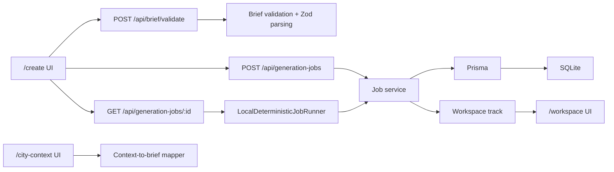

# Technical Decisions

This document explains the portfolio story behind the implementation: the product problem, why each technology was chosen, and which tradeoffs are intentional for a public-safe demo.

## Product problem

AI music creation products are not only about a "generate" button. A credible creation flow needs to handle:

- underspecified user prompts;
- estimated credit spend before generation;
- duplicate submit protection;
- asynchronous generation status;
- failed-job retry;
- durable workspace results;
- licensing and attribution reminders;
- clear public-safe boundaries when the project is inspired by a real company domain.

The project implements those product concerns with deterministic local behavior instead of claiming real AI generation or internal Muzig behavior.

## Technology choices

### Next.js App Router

**Why:** The demo needs both UI routes and API routes, but not enough production complexity to justify separate frontend and backend services.

**Problem solved:**

- keeps `/create`, `/workspace`, `/city-context`, and `/api/*` in one deployable app;
- makes the flagship flow easy to run locally and test end-to-end;
- keeps the portfolio review surface small and understandable.

**Tradeoff:** This is not a queue-heavy production architecture. If real generation workers were added, the route handlers should enqueue work and return immediately.

### TypeScript

**Why:** The flow crosses UI state, API payloads, persisted records, and service responses. Typed boundaries reduce mismatch between those layers.

**Problem solved:**

- shared `BriefInput`, `ValidationResult`, `JobResponse`, and `WorkspaceTrack` contracts;
- safer UI rendering of job timelines and workspace cards;
- faster refactoring as routes and service functions evolve.

### Zod

**Why:** API route handlers should reject malformed payloads before service logic runs.

**Problem solved:**

- normalizes style tags from either comma-delimited strings or arrays;
- constrains prompt, genre, use-case, and demo outcome fields;
- returns structured 400 responses for invalid generation job payloads;
- separates input validation from product scoring logic.

**Tradeoff:** The schema intentionally does not reject short prompts, because underspecified prompts are a valid product case that should produce warnings and suggestions instead of a hard API failure.

### Prisma + SQLite

**Why:** The demo needs durable local state without requiring external infrastructure.

**Problem solved:**

- stores briefs, jobs, timelines, and workspace tracks;
- supports idempotency through a unique `idempotencyKey`;
- makes local setup reproducible for reviewers.

**Tradeoff:** SQLite is appropriate for local portfolio review. A deployed multi-user version should move to Postgres, Turso, or another hosted database.

### Deterministic local job runner

**Why:** Real AI music generation is outside the safety and scope boundary. The demo still needs to prove async-job product behavior.

**Problem solved:**

- simulates `queued -> running -> completed` or `failed`;
- makes retry demos reliable;
- keeps E2E tests deterministic;
- isolates future queue replacement behind `LocalDeterministicJobRunner`.

**Tradeoff:** The runner derives status from elapsed time and local records. A production system would use a durable worker, queue events, and object storage for generated assets.

### Vitest and Playwright

**Why:** The portfolio needs proof, not just screenshots.

**Problem solved:**

- Vitest checks validation, city-context mapping, idempotency, retry history, and workspace persistence;
- Playwright checks the user-visible flagship flow and public-safe documentation framing.

## Architecture summary

## What to say in an interview

Short version:

> I built a public-safe AI music creation workflow demo. The focus was not real generation, but product concerns around prompt quality, credit estimation, idempotent job creation, async status, retry, and workspace persistence. I used Next.js for a compact full-stack app, Prisma/SQLite for reproducible local state, Zod for API boundary validation, and a deterministic job runner so the async flow is testable and demoable.

Deeper technical point:

> I intentionally separated hard API validation from product-level brief validation. Malformed payloads fail at the Zod boundary, while valid but weak prompts continue through the product flow and return warnings, suggestions, and a lower quality score. That mirrors how creation products should guide users instead of simply rejecting them.
